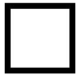
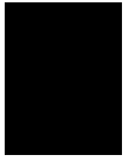

## 纯css创建三角形

```html
<!DOCTYPE html>
<html lang="en">
<head>
    <meta charset="UTF-8">
    <meta http-equiv="Cache-Control" content="no-cache">
    <title>test my Javascript</title>
    <style>
       #div1 {
           width: 100px;
           height: 100px;

           border-style: solid;
           border-width: 10px;
           border-color: black;
       }
    </style>
</head>
<body>
    <div id="div1"></div>
</body>
<script>
</script>
</html>
```
***

***
* 改变边框的宽度
```html
<style>
       #div1 {
           width: 100px;
           height: 100px;

           border-style: solid;
           border-width: 10px 100px 150px 100px;
           border-color: black;
       }
    </style>
```
***

***
* 注意我将width设置为0的变化
```html
    <style>
       #div1 {
           width: 0px;
           height: 100px;

           border-style: solid;
           border-width: 10px 100px 150px 100px;
           border-color: black;
       }
    </style>
```
***

***
